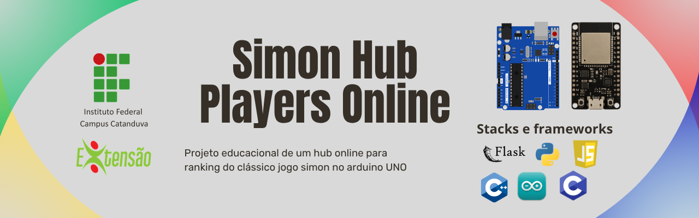
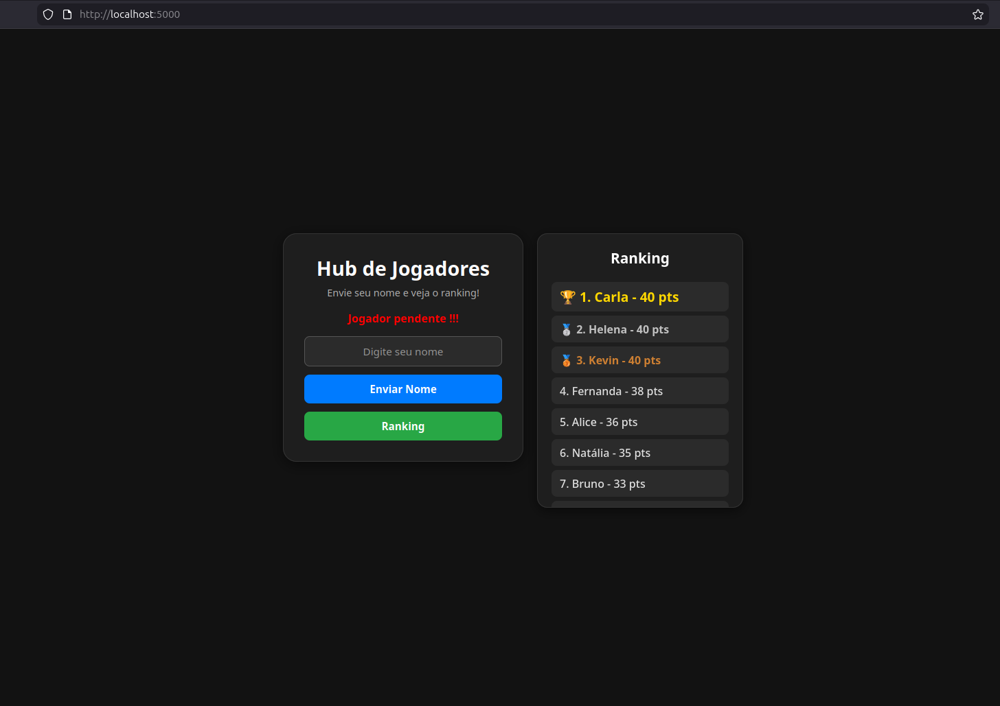

<h1>Simon Hub Players Online</h1>

Este projeto consiste na evolução do clássico <strong>Arduino Simon Game</strong> para um sistema integrado e distribuído,
no qual um jogo físico embarcado é conectado a uma aplicação web responsável pelo registro, processamento e visualização
de pontuações em tempo real.

A base do sistema é o firmware do jogo Simon desenvolvido para o microcontrolador ATmega328p, disponível em
<a href="https://github.com/DiogoHantke/Simon-memory-game-ATMEGA328p" target="_blank">
este repositório dedicado ao hardware
</a>, onde são implementadas as lógicas de geração de sequência, leitura de entradas, controle de LEDs e cálculo da pontuação.

A arquitetura deste projeto estende essa base embarcada, implementando um pipeline completo de dados: o jogo executado no Arduino
gera a pontuação do jogador, que é transmitida ao módulo <strong>ESP8266</strong>. Este atua como cliente de rede, estabelecendo
comunicação via protocolo HTTP com um backend desenvolvido em <strong>Python (Flask)</strong>, responsável por validar, armazenar
e organizar as informações em um banco de dados <strong>SQLite</strong>.

O sistema resolve problemas reais de sincronização e consistência, como o controle de jogadores pendentes (pontuações sem identificação),
garantindo a correta associação entre score e usuário. Além disso, disponibiliza uma interface web dinâmica que permite o cadastro de nomes,
visualização do ranking ordenado e interação em tempo quase real com o estado do sistema.

Mais do que um simples projeto de interface ou firmware, esta solução representa a integração entre diferentes camadas tecnológicas —
hardware embarcado, comunicação em rede, backend e frontend — evidenciando na prática conceitos fundamentais de sistemas distribuídos,
IoT e arquitetura cliente-servidor.

O resultado é a transformação de um sistema embarcado isolado em uma aplicação conectada, capaz de persistir dados, centralizar informações
e oferecer uma experiência ampliada ao usuário, aproximando o desenvolvimento de sistemas embarcados da realidade de aplicações modernas
baseadas em rede.

<h2>Participantes do Projeto</h2>
<ul>
    <li>Aparecido Orlando Virgili Neto</li>
    <li>Breno Souza Bernardi</li>
    <li>Bruno Travagli Sereço</li>
    <li>Daniel Lourenço Chereze Aparecida</li>
    <li>Diego Martins de Aquino</li>
    <li>Diogo Hantke Rodrigues Garcia</li>
    <li>Leticia Polatto de Novaes</li>
    <li>Luiz dos Santos Menino Neto</li>
    <li>Naiane Garcia da Silva</li>
    <li>Pedro Henrique Fuzaro Mori</li>
    <li>Rafael Rebolo Belarmino</li>
    <li>Samara Hélem Fonseca</li>
    <li>Thiago Augusto Savenhago</li>
    <li>Vinícius Souza Cardozo</li>
    <li>Wesley Mateus Basso</li>
</ul>

<h2>Orientação</h2>
<ul>
    <li>Prof. Paulo Palota</li>
    <li>Prof. Ricardo Joaquim</li>
    <li>Prof. Cristiano Donizeti Ferrari</li>
</ul>

<h2>Sumário</h2>
<ul>
    <li><a href="#pipeline">Pipeline Completo do Sistema</a></li>
    <li><a href="#sistema">Sistema de Arquivos</a></li>
    <li><a href="#execucao">Execução</a></li>
    <li><a href="#estrutura">Estrutura do Backend</a></li>
    <li><a href="#codigo">Explicação do Código</a></li>
    <li><a href="#melhorias">Melhorias Futuras</a></li>
    <li><a href="#objetivo">Objetivo Educacional</a></li>
</ul>

<h2 id="pipeline">Pipeline Completo do Sistema</h2>

O sistema é dividido em várias camadas, cada uma responsável por parte do fluxo de dados:

<ol>
    <li><strong>Jogo Simon (Arduino)</strong>
        <ul>
            <li>O firmware <code>Simon.ino</code> roda no Arduino com LEDs, botões e buzzer.</li>
            <li>O jogador segue a sequência do Simon, e o Arduino calcula a pontuação ao final da partida.</li>
            <li>A pontuação é passada ao ESP8266 (via serial ou simulação) para envio ao backend.</li>
        </ul>
    </li>
    <li><strong>Envio de dados (ESP8266)</strong>
        <ul>
            <li>ESP8266 se conecta à mesma rede que o servidor web.</li>
            <li>Recebe ou simula pontuações via <code>ESP8266.ino</code> ou <code>simul.py</code>.</li>
            <li>Envio via HTTP POST em JSON para backend Python.</li>
        </ul>
    </li>
    <li><strong>Backend Web (Python + Flask)</strong>
        <ul>
            <li>Servidor Flask recebe requisições HTTP e renderiza interface.</li>
            <li>Chama funções do <code>servicesControl.py</code> para validar dados e atualizar ranking.</li>
            <li>Armazena informações no SQLite via <code>databaseControl.py</code>.</li>
        </ul>
    </li>
    <li><strong>Banco de Dados (SQLite)</strong>
        <ul>
            <li>Tabela <code>players</code> com <code>id</code>, <code>username</code> e <code>score</code>.</li>
            <li>Permite armazenamento persistente, consultas e ranking ordenado por pontuação.</li>
        </ul>
    </li>
    <li><strong>Interface Web</strong>
        <ul>
            <li>HTML + JavaScript exibindo ranking dinâmico e formulários para enviar nomes.</li>
            <li>Ranking pode ser baixado em PDF usando jsPDF.</li>
            <li>Mensagens de status para indicar quando há jogadores pendentes.</li>
        </ul>
    </li>
</ol>

<strong>Resumo (Fluxograma):</strong>

<pre>
[Jogador interage com o Simon]
                ↓
[Arduino (ATmega328p)]
(Gera sequência → Lê entradas → Calcula score)
                ↓
[Comunicação Serial]
(Envio do score)
                ↓
[ESP8266]
(Recebe dados → Converte para JSON)
                ↓
[HTTP POST]
(Envio para backend)
                ↓
[Backend Flask]
(Validação → Controle de estado → Regras de negócio)
                ↓
[SQLite]
(Armazena score → Gerencia pendentes → Ordena ranking)
                ↓
[Backend Flask]
(Consulta dados → Gera respostas)
                ↓
[Interface Web]
(Requisições periódicas → Envio de username)
                ↓
[Renderização no Frontend]
(Atualiza ranking → Feedback visual)
</pre>

<h2 id="sistema">Sistema de Arquivos</h2>
<pre>
.
├── backend/
│   └── app/
│       ├── database/
│       │   ├── databaseControl.py
│       │   ├── database.db
│       │   └── __pycache__/
│       ├── services/
│       │   ├── servicesControl.py
│       │   └── __pycache__/
│       ├── static/
│       │   ├── script.js
│       │   └── style.css
│       ├── templates/
│       │   └── index.html
│       ├── main.py
│       └── __init__.py
├── Hardware/
│   ├── ESP8266/
│   │   ├── ESP8266.ino
│   │   └── simul.py
│   └── Simon/
│       └── Simon.ino
└── README.md
</pre>

<h2 id="execucao">Execução</h2>
<ol>
    <li>Instalar dependências Python: <code>Flask</code> (pip install flask) e sqlite3 (embutido).</li>
    <li>Executar backend:
        <pre><code>python3 backend/app/main.py</code></pre>
    </li>
    <li>Acessar o site via <code>http://localhost:5000</code>.</li>
    <li>ESP8266 envia dados de jogadores ao backend.</li>
    <li>Ranking é atualizado e exibido na interface web.</li>
</ol>

<h2 id="estrutura">Estrutura do Backend</h2>
<ul>
    <li><strong>databaseControl.py</strong> — gerencia CRUD do SQLite.</li>
    <li><strong>servicesControl.py</strong> — lógica de registro de jogadores, pontuação e ranking.</li>
    <li><strong>main.py</strong> — servidor Flask, define rotas HTTP e renderiza templates.</li>
    <li><strong>templates/index.html</strong> — interface web do ranking.</li>
    <li><strong>static/script.js / style.css</strong> — comportamento dinâmico e estilo da página.</li>
</ul>

<h2 id="codigo">Explicação Detalhada do Código</h2>
<h3>main.py</h3>

Responsável por inicializar Flask, criar tabelas e definir rotas do sistema:

<ul>
<li><strong>createTables()</strong> — garante que a estrutura de persistência exista antes de qualquer operação.</li>
<li><strong>Rota "/"</strong> — ponto de entrada da interface do sistema.</li>
<li><strong>Rota "/score"</strong> — recebe eventos de pontuação vindos do sistema embarcado.</li>
<li><strong>Rota "/username"</strong> — recebe identificação do jogador associada a uma pontuação pendente.</li>
<li><strong>Rota "/search"</strong> — expõe o estado interno do sistema (jogadores pendentes).</li>
<li><strong>Rota "/ranking"</strong> — fornece uma visão consolidada dos dados processados.</li>
</ul>

<strong>Detalhamento interno:</strong>

O <strong>main.py</strong> atua como a camada de interface do backend, sendo responsável por conectar o mundo externo (rede HTTP) à lógica interna do sistema.

Seu papel não é processar regras de negócio, mas sim:

<ul>
<li>Receber requisições externas</li>
<li>Interpretar dados de entrada (JSON)</li>
<li>Encaminhar esses dados para a camada de serviços</li>
<li>Retornar respostas ao cliente</li>
</ul>

Ele define o <strong>boundary do sistema</strong>, ou seja, o ponto onde dados entram e saem. Toda requisição que chega ao sistema passa obrigatoriamente por essa camada.

Na pipeline, ele representa:

<strong>Rede → Sistema interno</strong>

<h3>servicesControl.py</h3>

Lógica de manipulação de pontuação e nomes:

<ul>
<li><strong>insertScore(data)</strong></li>
</ul>

Essa função representa o processamento do evento “nova pontuação”.

O fluxo lógico é:

<ul>
<li>Validar a estrutura dos dados recebidos</li>
<li>Validar o significado dos dados</li>
<li>Verificar o estado atual do sistema (existem jogadores pendentes?)</li>
</ul>

A principal decisão de projeto está aqui:

<ul>
<li>O sistema não permite múltiplos estados pendentes simultâneos</li>
<li>Se existir uma pontuação sem identificação, novas pontuações são bloqueadas</li>
</ul>

Isso resolve um problema crítico: <strong>sincronização de eventos assíncronos</strong>

Na prática, você implementa:

<ul>
<li>Controle de concorrência</li>
<li>Ordenação de eventos</li>
<li>Consistência de dados</li>
</ul>

A pontuação só é persistida se o sistema estiver em um estado válido.

<ul>
<li><strong>insertUsername(data)</strong></li>
</ul>

Essa função resolve o segundo estágio do evento: associar um nome a uma pontuação previamente registrada.

O comportamento lógico é:

<ul>
<li>Buscar todos os registros pendentes</li>
<li>Selecionar o mais antigo (ordem de chegada)</li>
<li>Associar o nome a esse registro</li>
</ul>

Isso implementa um modelo de processamento baseado em fila:

<ul>
<li>Primeiro evento: score</li>
<li>Segundo evento: username</li>
<li>Regra: ordem FIFO (First In, First Out)</li>
</ul>

Esse mecanismo garante que:

<ul>
<li>Eventos sejam processados na ordem correta</li>
<li>Não haja inconsistência entre score e jogador</li>
</ul>

Na pipeline, essa camada representa:

<strong>Validação → Controle de estado → Regra de negócio</strong>

<h3>databaseControl.py</h3>

Gerenciamento do banco SQLite:

O banco de dados não é utilizado apenas para armazenamento, mas como uma estrutura ativa no controle do sistema.

Ele desempenha três papéis fundamentais:

<ul>
<li>Persistência de dados</li>
<li>Ordenação temporal de eventos</li>
<li>Controle de estado (pendente vs processado)</li>
</ul>

O conceito central é:

<ul>
<li>Registros sem nome representam estados incompletos (pendentes)</li>
<li>Registros com nome representam estados finalizados</li>
</ul>

A ordenação por identificador define implicitamente o tempo de chegada dos eventos, permitindo implementar comportamento de fila sem estrutura explícita em memória.

Além disso, o banco define a lógica de ranking:

<ul>
<li>Ordenação por pontuação</li>
<li>Critério temporal para desempate</li>
<li>Consistência determinística</li>
</ul>

Na pipeline, o banco representa:

<strong>Persistência + Fonte de verdade + Estrutura de controle</strong>

<h3>ESP8266.ino</h3>

O ESP8266 atua como um <strong>gateway de comunicação</strong> entre o sistema embarcado e a rede.

Seu papel lógico é transformar dados locais em dados transmitidos via protocolo de rede.

Fluxo de funcionamento:

<ul>
<li>Receber dados do Arduino via comunicação serial</li>
<li>Interpretar o protocolo de entrada</li>
<li>Converter o dado em formato estruturado</li>
<li>Enviar para o backend via HTTP</li>
</ul>

Além disso, ele implementa mecanismos de robustez:

<ul>
<li>Controle de reconexão</li>
<li>Evitar envio excessivo</li>
<li>Garantir entrega consistente</li>
</ul>

Ele resolve o problema de transportar eventos físicos para um sistema distribuído.

Na pipeline, ele representa:

<strong>Serial → Transformação → Rede</strong>

<h3>script.js</h3>

O frontend é responsável por consumir os dados processados e refletir o estado do sistema para o usuário.

Seu papel lógico envolve:

<ul>
<li>Enviar dados do usuário para o backend</li>
<li>Consultar o estado do sistema</li>
<li>Atualizar a interface dinamicamente</li>
</ul>

Um ponto importante é o uso de polling:

<ul>
<li>Consulta periódica ao backend</li>
<li>Verificação de jogadores pendentes</li>
<li>Atualização da interface</li>
</ul>

Isso cria sincronização indireta entre frontend e backend sem conexão persistente.

Além disso, o frontend:

<ul>
<li>Transforma JSON em interface visual</li>
<li>Fornece feedback ao usuário</li>
</ul>

Na pipeline, ele representa:

<strong>Consumo → Interpretação → Visualização</strong>

<h2 id="melhorias">Melhorias Futuras</h2>
<ul>
    <li><strong>Sistema de autenticação e identificação persistente:</strong> criação de usuários com identificação única, evitando conflitos de nomes e permitindo histórico individual.</li>
    <li><strong>Histórico de partidas e análise de desempenho:</strong> armazenamento de múltiplas partidas por jogador, possibilitando métricas como média de pontuação, evolução temporal e detecção de padrões de jogo.</li>
    <li><strong>Arquitetura orientada a múltiplos dispositivos:</strong> suporte a vários ESP8266/ESP32 enviando dados simultaneamente para um backend centralizado (escala horizontal).</li>
    <li><strong>Comunicação segura (HTTPS + validação):</strong> uso de TLS e validação de requisições para evitar envio malicioso de pontuações (ex: spoofing de score).</li>
    <li><strong>Fila de processamento e desacoplamento:</strong> introdução de filas (ex: Redis, RabbitMQ) para desacoplar recepção de dados do processamento, aumentando robustez do sistema.</li>
    <li><strong>Melhoria de UX/UI:</strong> interface responsiva, feedback em tempo real com WebSockets e visualização dinâmica de ranking.</li>
    <li><strong>Exportação e integração de dados:</strong> APIs externas ou exportação em formatos (CSV, JSON) para análise offline ou integração com outros sistemas.</li>
</ul>

<h2 id="objetivo">Objetivo Educacional</h2>
<ul>
    <li><strong>Integração de sistemas ciberfísicos:</strong> conectar um sistema embarcado real (Arduino Simon Game) a uma aplicação web, compreendendo o fluxo completo de dados do hardware até o software.</li>
    <li><strong>Arquitetura cliente-servidor aplicada a IoT:</strong> implementação de comunicação via HTTP entre dispositivos embarcados (ESP8266) e backend, explorando conceitos de rede, protocolos e serialização de dados (JSON).</li>
    <li><strong>Separação de responsabilidades (camadas):</strong> divisão clara entre:
        <ul>
            <li>camada de apresentação (frontend)</li>
            <li>camada de serviço (regras de negócio)</li>
            <li>camada de persistência (SQLite)</li>
        </ul>
    </li>
    <li><strong>Modelagem e persistência de dados:</strong> uso de banco relacional leve (SQLite), incluindo criação de schema, consultas, ordenação e consistência de dados.</li>
    <li><strong>Validação e controle de fluxo de estados:</strong> tratamento de estados intermediários (jogadores pendentes), evitando inconsistências entre score e identificação.</li>
    <li><strong>Comunicação entre sistemas heterogêneos:</strong> integração entre:
        <ul>
            <li>firmware em C/C++ (Arduino/ESP)</li>
            <li>backend em Python (Flask)</li>
            <li>frontend em JavaScript</li>
        </ul>
    </li>
    <li><strong>Compreensão de pipelines distribuídos:</strong> análise do fluxo completo:
         <code>Hardware → Serial → ESP8266 → HTTP → Backend → Banco de Dados → Interface Web</code>
    </li>
    <li><strong>Aplicação prática de conceitos de engenharia:</strong> transformar um sistema físico simples (jogo Simon) em uma solução integrada com persistência, comunicação em rede e visualização de dados.</li>
</ul>

Este projeto foi desenvolvido com o objetivo de estender o jogo físico <strong>Simon</strong> implementado em Arduino,
criando um sistema centralizado de registro de pontuações. A proposta é transformar uma interação local (jogo embarcado)
em um sistema conectado, capaz de armazenar, processar e exibir dados em tempo real, aproximando o desenvolvimento de
sistemas embarcados da realidade de aplicações distribuídas e IoT.

